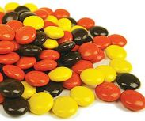

#RSS Pieces


Very minimal RSS reader mindful of resources and complexity (including minimal dependencies).  Server and client side cacheing.  Node.js backend w/ frontend browserified bundeled script for dropping into HTML.  Typescript!  

TODO
-----
* Deployment scripts (Ansible)
* Interface to add feeds
  * security
  * persistance (likely key/value file storage)
* Switch from TSD to Typings
* tests
* favicon (https://github.com/adam-p/markdown-here/wiki/Markdown-Cheatsheet#code)
* clean-up directory structure

Try it out
-----
*npm run start*
Transpiles, bundles, and starts Express server.  A web server will need to serve the static root content ([http-server](https://www.npmjs.com/package/http-server)).  
Also PHP these days has a built in web server:
```php -S localhost:8080```


